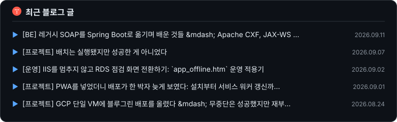
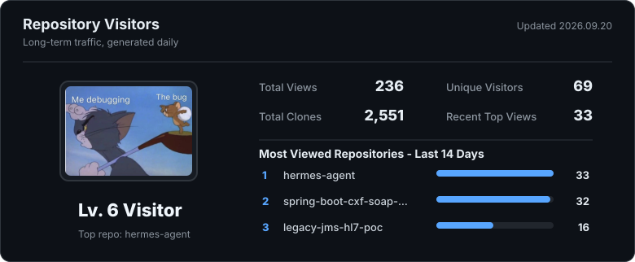

<h1>
    

        <ruby>
            장현호
            <rp>(</rp><rt>Backend Engineer</rt><rp>)</rp>
        </ruby>
    

    
  <!--  -->
</h1>

  

<!--  -->
<!--   -->

##  &nbsp; **About me** 
<!--   -->

- 🔭 I’m currently working on my Web & Server development skills.
<!-- - 🌱 I’m currently learning Next.js(TypeScript) & Spring Boot(Kotlin, Java) by building projects. -->
- 🌱 I’m currently learning Spring Boot(Kotlin, Java), AI(Python) by building projects.
- 🧑🏻‍💻 I am interested in Backend Design and Development, Microservice architecture, Micro front-end architecture and Cloud Native technologies.
- 💼 Currently working at a major KOSPI-listed corporation.
- 🤓 Currently working on Full Stack Development!
- 😄 I love exploring and learning new skills as well as implement those in my projects.
- 📫 How to reach me: **hyunho.jang.dev@gmail.com**
- ⚡ Fun fact I also love to hear songs during coding.

## 📝 최근 블로그 글

 
 

## Repository Visitors

<!--

 
</img>
</img>

 -->
<!--  -->

<!-- 참고 URL
https://github.com/devxb/gitanimals  -->
<a href="https://github.com/hyunolike">
<!--    -->
    
  
  
  

  
</a>
<!-- <picture>
  <source media="(prefers-color-scheme: dark)" srcset="https://raw.githubusercontent.com/platane/platane/output/github-contribution-grid-snake-dark.svg">
  <source media="(prefers-color-scheme: light)" srcset="https://raw.githubusercontent.com/platane/platane/output/github-contribution-grid-snake.svg">
  
</picture> -->

        

<!-- 2023/04/28일자 주석 처리 :: 첫 깃허브 프로필 입니다 :) -->
<!-- 
<h2> Hi, I'm Hyunho Jang   </h2>

<!--  -->

<!-- 
<em>“In the one and only true way. The object-oriented version of ‘Spaghetti code’ is, of course, ‘Lasagna code’. (Too many layers).”</em>

 -->

<!-- 기본 프로필 -->
<!--  -->
<!--  -->

